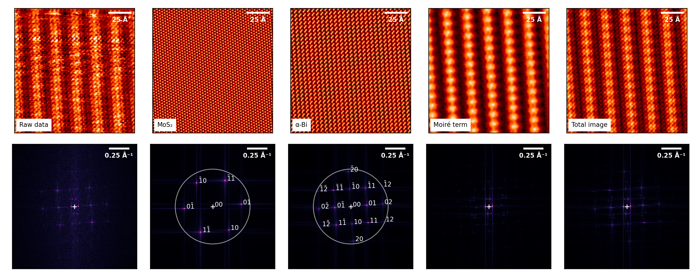

# MPWEM
Moiré plane wave expansion model
Python library and example file.
(c) Maxime Le Ster, 2023-2024

## Introduction

Full paper describing the MPWEM can be found (DOI: 10.48550/arXiv.2310.06535, <a href="https://arxiv.org/abs/2310.06535" target="_blank">link</a>)

The python library (MPWEM.py) allows to simulate a scanning tunneling microscopy (STM) image for arbitrary layer geometries and twist angles using the MPWEM.
The main ingredients of the MPWEM are:

1) Plane wave parameters of the substrate layer
2) Plane wave parameters of the top layer
3) MPWEM parameters (mu, tau, a0, eta)

The MPWEM.py library and example.py file should be useful for anyone interested in STM simulation of moiré systems. Feel free to download the files and manipulate the inputs to your liking to test the model on your preferred 2D materials. If you require assistance, find my contact information below and send me an email!

## Files 

The example.py is a python script implementing the MPWEM.py functions leading to the STM simulated image (includes plotting routines). The file should be adequately commented for detailed understanding at each step of the simulation procedure. The physical system in the example file is alpha-bismuthene (aBi) on molybdenum disulfide (MoS2) used in the reference paper. The raw STM data is contained in the bimos2_rawdata.txt.

## Dependencies

The following python libraries are required: numpy, matplotlib, scipy and time. The extra python file (symbols.py) is a library of special characters and only used for display purposes.

## Contact

For more information, please contact me via email at maxime.lester@fis.uni.lodz.pl (or pawel.kowalczyk@uni.lodz.pl)

If this model is useful, please cite the reference paper (M. Le Ster et al., Phys.  Rev. B 110, 195418 (2024); DOI: 10.1103/PhysRevB.110.195418, <a href="https://doi.org/10.1103/PhysRevB.110.195418" target="_blank">link</a>).
